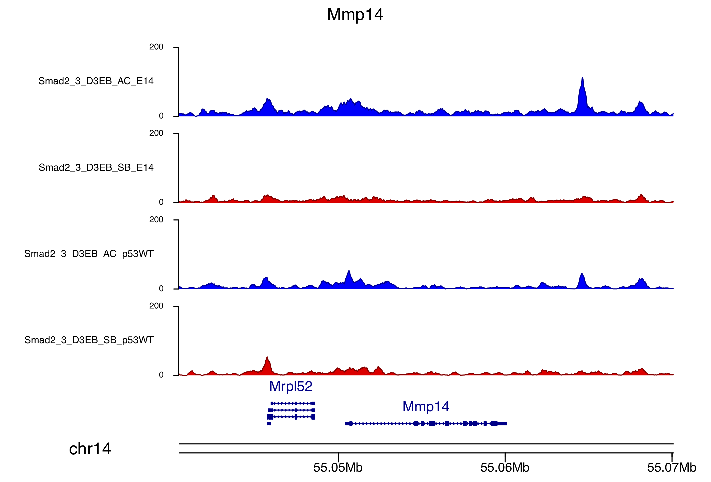

# Paper Title
### Paper Details


## Investigating Mmp expression in scRNA-Seq

### Step 1: Get expression for Mmp genes in published scRNA-seq data

* Cheng, S., Pei, Y., He, L., Peng, G., Reinius, B., Tam, P.P.L, Jing, N. and Deng, Q. (2019) Single-Cell {RNA}-Seq Reveals Cellular Heterogeneity of Pluripotency Transition and X Chromosome Dynamics during Early Mouse Development. Cell Reports. 26:10, 2593--2607.e3. [[DOI](https://doi.org/10.1016/j.celrep.2019.02.031)]

Download supplimental files from [GSE109071](https://www.ncbi.nlm.nih.gov/geo/query/acc.cgi?acc=GSE109071)

* [GSE109071_read.txt](https://www.ncbi.nlm.nih.gov/geo/download/?acc=GSE109071&format=file&file=GSE109071%5Fread%2Etxt%2Egz)
* [GSE109071_rpkm.txt](https://www.ncbi.nlm.nih.gov/geo/download/?acc=GSE109071&format=file&file=GSE109071%5Frpkm%2Etxt%2Egz)
* [GSE109071_series_matrix.txt](http://ftp.ncbi.nlm.nih.gov/geo/series/GSE109nnn/GSE109071/matrix/GSE109071_series_matrix.txt.gz)

Use bash script [make_sample2Age_table.sh](scRNA/make_sample2Age_table.sh) to make a look up table of cell idetifiers to cell ages [sample2age.tab.csv](scRNA/sample2age.tab.csv)

Using the R script [CTR_mz205_0007.scRNA.R](scRNA/CTR_mz205_0007.scRNA.R) to first cluster and plot a dimensional reduction (UMAP) of the scRNA-seq data (note the original paper used tSNE). To identify the Epiblast cells _Pou5f1_ was used as a marker. Clusters excluded from further analysis are the ExE (marker = _Bmp4_) and VE (marker = _Amn_). The figure below shows: __A.__ Finding clusters, __B.__ cluster identification using markers and __C.__ Labelling identified clusters.


__Download Figure__:  [[PDF](scRNA/CTR_mz205_0007_scUMAPs.pdf)] [[PNG](scRNA/CTR_mz205_0007_scUMAPs.png)]

### Step 2: Analyse expression for Mmp genes in published scRNA-seq data

#### Expression Vs Age


__Download Figure__: [[CTR_mz205_0007_mmp.age.pdf](scRNA/CTR_mz205_0007_mmp.age.pdf)] [[CTR_mz205_0007_mmp.age.png](scRNA/CTR_mz205_0007_mmp.age.png)]


#### Correlations to marker genes
After extraction of the Epiblast cells from the scRNA-seq the next step is to plot the Mmp expression values against a selection of markers: T, Otx2 and Nodal. r values are Pearson's correlations with p.value.

Example for Mmp14:


| Mmp   | PNG | PDF  |
| ----- | --- | ---- |
| Mmp1a | [CTR_mz205_0007_Mmp1a.png](scRNA/CTR_mz205_0007_Mmp1a.png) | [CTR_mz205_0007_Mmp1a.pdf](scRNA/CTR_mz205_0007_Mmp1a.pdf) |
| Mmp1b | [CTR_mz205_0007_Mmp1b.png](scRNA/CTR_mz205_0007_Mmp1b.png) | [CTR_mz205_0007_Mmp1b.pdf](scRNA/CTR_mz205_0007_Mmp1b.pdf) |
| __Mmp2__  | [CTR_mz205_0007_Mmp2.png](scRNA/CTR_mz205_0007_Mmp2.png)   | [CTR_mz205_0007_Mmp2.pdf](scRNA/CTR_mz205_0007_Mmp2.pdf) |
| Mmp3 | _missing_ | _missing_ |
| Mmp7  | [CTR_mz205_0007_Mmp7.png](scRNA/CTR_mz205_0007_Mmp7.png)   | [CTR_mz205_0007_Mmp7.pdf](scRNA/CTR_mz205_0007_Mmp7.pdf) |
| Mmp8 | _missing_ | _missing_ |
| Mmp9  | [CTR_mz205_0007_Mmp9.png](scRNA/CTR_mz205_0007_Mmp9.png)   | [CTR_mz205_0007_Mmp9.pdf](scRNA/CTR_mz205_0007_Mmp9.pdf) |
| Mmp10 | _missing_ | _missing_ |
| Mmp11 | [CTR_mz205_0007_Mmp11.png](scRNA/CTR_mz205_0007_Mmp11.png) | [CTR_mz205_0007_Mmp11.pdf](scRNA/CTR_mz205_0007_Mmp11.pdf) |
| Mmp12 | [CTR_mz205_0007_Mmp12.png](scRNA/CTR_mz205_0007_Mmp12.png) | [CTR_mz205_0007_Mmp12.pdf](scRNA/CTR_mz205_0007_Mmp12.pdf) |
| Mmp13 | _missing_ | _missing_ |
| __Mmp14__ | [CTR_mz205_0007_Mmp14.png](scRNA/CTR_mz205_0007_Mmp14.png) | [CTR_mz205_0007_Mmp14.pdf](scRNA/CTR_mz205_0007_Mmp14.pdf) |
| Mmp15 | [CTR_mz205_0007_Mmp15.png](scRNA/CTR_mz205_0007_Mmp15.png) | [CTR_mz205_0007_Mmp15.pdf](scRNA/CTR_mz205_0007_Mmp15.pdf) |
| Mmp16 | [CTR_mz205_0007_Mmp16.png](scRNA/CTR_mz205_0007_Mmp16.png) | [CTR_mz205_0007_Mmp16.pdf](scRNA/CTR_mz205_0007_Mmp16.pdf) |
| Mmp17 | [CTR_mz205_0007_Mmp17.png](scRNA/CTR_mz205_0007_Mmp17.png) | [CTR_mz205_0007_Mmp17.pdf](scRNA/CTR_mz205_0007_Mmp17.pdf) |
| Mmp19 | [CTR_mz205_0007_Mmp19.png](scRNA/CTR_mz205_0007_Mmp19.png) | [CTR_mz205_0007_Mmp19.pdf](scRNA/CTR_mz205_0007_Mmp19.pdf) |
| Mmp21 | [CTR_mz205_0007_Mmp21.png](scRNA/CTR_mz205_0007_Mmp21.png) | [CTR_mz205_0007_Mmp21.pdf](scRNA/CTR_mz205_0007_Mmp21.pdf) |
| Mmp23 | [CTR_mz205_0007_Mmp23.png](scRNA/CTR_mz205_0007_Mmp23.png) | [CTR_mz205_0007_Mmp23.pdf](scRNA/CTR_mz205_0007_Mmp23.pdf) |
| Mmp24 | [CTR_mz205_0007_Mmp24.png](scRNA/CTR_mz205_0007_Mmp24.png) | [CTR_mz205_0007_Mmp24.pdf](scRNA/CTR_mz205_0007_Mmp24.pdf) |
| __Mmp25__ | [CTR_mz205_0007_Mmp25.png](scRNA/CTR_mz205_0007_Mmp25.png) | [CTR_mz205_0007_Mmp25.pdf](scRNA/CTR_mz205_0007_Mmp25.pdf) |
| Mmp26 | _missing_ | _missing_ |
| Mmp27 | _missing_ | _missing_ |
| Mmp28 | [CTR_mz205_0007_Mmp28.png](CTR_mz205_0007_Mmp28.png) | [CTR_mz205_0007_Mmp28.png](CTR_mz205_0007_Mmp28.png) |

Missing Mmps, not present in the scRNA RPKM matrix.

| Mmp   | Reason missing |
| ----- | -------------- |
| Mmp3  | ? |
| Mmp8  | ? |
| Mmp10 | ? |
| Mmp13 | ? |
| Mmp26 | not found in mouse |
| Mmp27 | ? |


## Investigating Mmp ChIP-Seq associations

ChIP Data generated in this paper:

* Wang, Q., Zou, Y., Nowotschin, S., Kim, S.Y., Li, Q.V. Soh, C., Su, J. Zhang, C., Shu, W. Xi, Q., Huangfu, D., Hadjantonakis, A. and Massague, J. (2017) The p53 Family Coordinates Wnt and Nodal Inputs in Mesendodermal Differentiation of Embryonic Stem Cells. Cell Stem Cell, 20(11), 70-86. [[DOI](https://doi.org/10.1016/j.stem.2016.10.002)]

And used in:

* Senft, A.D., Costello, I., King, H.W., Mould, A.W., Bikoff, E.K. and Robertson, E.J. (2018) Combinatorial Smad2/3 Activities Downstream of Nodal Signaling Maintain Embryonic/Extra-Embryonic Cell Identities during Lineage Priming. Cell Reports, 24(8), 1977--1985.e7. [[DOI](https://doi.org/10.1016/j.celrep.2018.07.077)]

Accession for data:
* [GSE70486 TDF files](https://www.ncbi.nlm.nih.gov/geo/query/acc.cgi?acc=GSE70486)

Four tracks were chosen
* GSM1782914_Smad2_3_D3EB_AC_E14
* GSM1782915_Smad2_3_D3EB_SB_E14                      
* GSM1782928_Smad2_3_D3EB_AC_p53WT
* GSM1782929_Smad2_3_D3EB_SB_p53WT

The tracks are in IGVs __tdf__ format, but to be copatile with `karyoploteR` they must first be converted to __bedgraph__, and then finally to __bigwig__ using [convert_tdf2bedgraph2bigwig.sh](ChIP/convert_tdf2bedgraph2bigwig.sh) (which itself calls [bdg2bw.sh](ChIP/bdg2bw.sh) taken from this [Gist](https://gist.github.com/taoliu/2469050))

Example for Mmp14:



| Mmp   | ChIP Track Figure             |
| ----- | ----------------------------- |
| Mmp11 | [CTR_mz205_0007.ChIP.Mmp11.pdf](ChIP/CTR_mz205_0007.ChIP.Mmp11.pdf) |
| Mmp12 | [CTR_mz205_0007.ChIP.Mmp12.pdf](ChIP/CTR_mz205_0007.ChIP.Mmp12.pdf) |
| Mmp14 | [CTR_mz205_0007.ChIP.Mmp14.pdf](ChIP/CTR_mz205_0007.ChIP.Mmp14.pdf) |
| Mmp15 | [CTR_mz205_0007.ChIP.Mmp15.pdf](ChIP/CTR_mz205_0007.ChIP.Mmp15.pdf) |
| Mmp16 | [CTR_mz205_0007.ChIP.Mmp16.pdf](ChIP/CTR_mz205_0007.ChIP.Mmp16.pdf) |
| Mmp17 | [CTR_mz205_0007.ChIP.Mmp17.pdf](ChIP/CTR_mz205_0007.ChIP.Mmp17.pdf) |
| Mmp19 | [CTR_mz205_0007.ChIP.Mmp19.pdf](ChIP/CTR_mz205_0007.ChIP.Mmp19.pdf) |
| Mmp1a | [CTR_mz205_0007.ChIP.Mmp1a.pdf](ChIP/CTR_mz205_0007.ChIP.Mmp1a.pdf) |
| Mmp1b | [CTR_mz205_0007.ChIP.Mmp1b.pdf](ChIP/CTR_mz205_0007.ChIP.Mmp1b.pdf) |
| Mmp2  | [CTR_mz205_0007.ChIP.Mmp2.pdf](ChIP/CTR_mz205_0007.ChIP.Mmp2.pdf)  |
| Mmp21 | [CTR_mz205_0007.ChIP.Mmp21.pdf](ChIP/CTR_mz205_0007.ChIP.Mmp21.pdf) |
| Mmp23 | [CTR_mz205_0007.ChIP.Mmp23.pdf](ChIP/CTR_mz205_0007.ChIP.Mmp23.pdf) |
| Mmp24 | [CTR_mz205_0007.ChIP.Mmp24.pdf](ChIP/CTR_mz205_0007.ChIP.Mmp24.pdf) |
| Mmp25 | [CTR_mz205_0007.ChIP.Mmp25.pdf](ChIP/CTR_mz205_0007.ChIP.Mmp25.pdf) |
| Mmp28 | [CTR_mz205_0007.ChIP.Mmp28.pdf](ChIP/CTR_mz205_0007.ChIP.Mmp28.pdf) |
| Mmp7  | [CTR_mz205_0007.ChIP.Mmp7.pdf](ChIP/CTR_mz205_0007.ChIP.Mmp7.pdf)  |
| Mmp9  | [CTR_mz205_0007.ChIP.Mmp9.pdf](ChIP/CTR_mz205_0007.ChIP.Mmp9.pdf)  |


## Software Versions & Methods

````
R version 3.4.4 (2018-03-15)
Platform: x86_64-apple-darwin15.6.0 (64-bit)
Running under: macOS  10.14.4

Matrix products: default
BLAS: /System/Library/Frameworks/Accelerate.framework/Versions/A/Frameworks/vecLib.framework/Versions/A/libBLAS.dylib
LAPACK: /Library/Frameworks/R.framework/Versions/3.4/Resources/lib/libRlapack.dylib

locale:
[1] en_GB.UTF-8/en_GB.UTF-8/en_GB.UTF-8/C/en_GB.UTF-8/en_GB.UTF-8

attached base packages:
[1] stats     graphics  grDevices utils     datasets  methods   base     

other attached packages:
 [1] matrixStats_0.54.0 umap_0.2.2.0       viridis_0.5.1      viridisLite_0.3.0  cowplot_0.9.4      reshape2_1.4.3     dplyr_0.8.1       
 [8] Seurat_3.0.1       useful_1.2.6       ggplot2_3.1.1      Rtsne_0.15        
````

## Contact

Contact Russell S. Hamilton (rsh46 -at- cam.ac.uk)
