# Basement membrane remodelling regulates mammalian embryogenesis and gastrulation

**Christos Kyprianou<sup>1,4</sup>, Neophytos Christodoulou<sup>1,4</sup>, Russell Hamilton<sup>3</sup>, Wallis Nahaboo<sup>2</sup>, Diana Suarez Boomgaard<sup>2</sup>, Gianluca Amadei<sup>1</sup>, Isabelle Migeotte<sup>2</sup>, and Magdalena Zernicka-Goetz<sup>1,*</sup>**

<sup>1</sup> Mammalian Embryo and Stem Cell Group, University of Cambridge, Department of Physiology, Development and Neuroscience; Downing Street, Cambridge, CB2 3DY, UK <br>
<sup>2</sup> IRIBHM, Université Libre de Bruxelles, Bruxelles, Belgium<br>
<sup>3</sup> Department of Genetics, University of Cambridge, Cambridge, UK<br>
<sup>4</sup> equal contribution<br>
<sup>*</sup> corresponding author: mz205@cam.ac.uk<br>

### Publication ###

Kyprianou, C., Christodoulou, N., Hamilton, R.S., Nahaboo, W., Boomgaard, D., Amadei, G., Migeotte, I. & Zernicka-Goetz, M. [[<s>JOURNAL</s>]](https://) [[<s>DOI</s>]](https://doi.org/) (<i>to be updated on publication</i>)


## Investigating Mmp expression in scRNA-Seq

### Step 1: Get expression for Mmp genes in published scRNA-seq data

* Cheng, S., Pei, Y., He, L., Peng, G., Reinius, B., Tam, P.P.L, Jing, N. and Deng, Q. (2019) Single-Cell RNA-Seq Reveals Cellular Heterogeneity of Pluripotency Transition and X Chromosome Dynamics during Early Mouse Development. Cell Reports. 26:10, 2593--2607.e3. [[DOI](https://doi.org/10.1016/j.celrep.2019.02.031)]

Download supplemental files from [GSE109071](https://www.ncbi.nlm.nih.gov/geo/query/acc.cgi?acc=GSE109071)

* [GSE109071_read.txt](https://www.ncbi.nlm.nih.gov/geo/download/?acc=GSE109071&format=file&file=GSE109071%5Fread%2Etxt%2Egz)
* [GSE109071_rpkm.txt](https://www.ncbi.nlm.nih.gov/geo/download/?acc=GSE109071&format=file&file=GSE109071%5Frpkm%2Etxt%2Egz)
* [GSE109071_series_matrix.txt](http://ftp.ncbi.nlm.nih.gov/geo/series/GSE109nnn/GSE109071/matrix/GSE109071_series_matrix.txt.gz)

__Methods: Single Cell__

Re-analysis of the [GSE109071](https://www.ncbi.nlm.nih.gov/geo/query/acc.cgi?acc=GSE109071)(from 10.1016/j.celrep.2019.02.031) dataset was performed using R (v3.4.4) and Seurat (v3.0.1). The matrix of read counts was input into Seurat, normalised (log), and scaled. Three thousand variable genes were used to identify clusters. Dimensional reduction was performed using UMAP. Cell identifiers were parsed from the GEO entry and added to the Seurat Object using ( make_sample2Age_table.sh). All expression values are log(counts). Marker genes were used to identify the Epiblast (_Pou5f1_), ExE (_Bmp4_) and VE (_Amn_) cells in the UMAP. The matrix of RPKM values from [GSE109071](https://www.ncbi.nlm.nih.gov/geo/query/acc.cgi?acc=GSE109071) was used to calculate gene expression correlation between pairs of selected genes. Epiblast cells at ages 6.25 and 6.5 were extracted from the matrix and Pearson's correlation coefficient (R) with p-value are given for each comparison. The points are coloured by density using a kde2d kernel.


| Figure E4B | 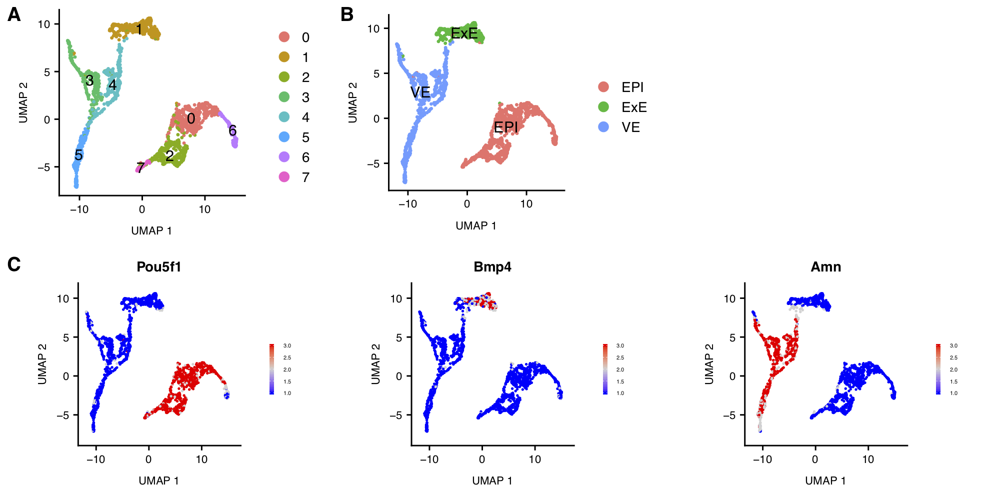   |
| --------- | --- |
| __Download__ | [[PDF](scRNA/CTR_mz205_0007_scUMAPs.pdf)] |
| __Legend__ |  Marker genes were used to identify the Epiblast (_Pou5f1_), ExE (_Bmp4_) and VE (_Amn_) cells in the UMAP.


#### Find cells in UMAP by Age

Use bash script [make_sample2Age_table.sh](scRNA/make_sample2Age_table.sh) to make a look up table of cell identifiers to cell ages [sample2age.tab.csv](scRNA/sample2age.tab.csv)

> Number of cells by age

| Age     | Number of Cells |
| ------- | --------------- |
| __All__ | __1724__        |
| 5.25    |    331          |
| 5.5     |    269          |
| 6.25    |    321          |
| 6.5     |    803          |

> Number of cells by cell type

| CellType | Number of Cells |
| -------- | --------------- |
| __All__  | __1724__        |
| EPI      | 775             |
| ExE      | 283             |
| VE       | 666             |

> Number of cells by cell type and age

|          | EPI | ExE | VE  |
| -------- | --- | --- | --- |
| __5.25__ | 128 |  67 | 136 |
| __5.5__  | 120 |  45 | 104 |
| __6.25__ | 143 |  87 |  91 |
| __6.5__  | 384 |  84 | 335 |

> UMAP showing distribution of cells by age:

| Figure E4A | 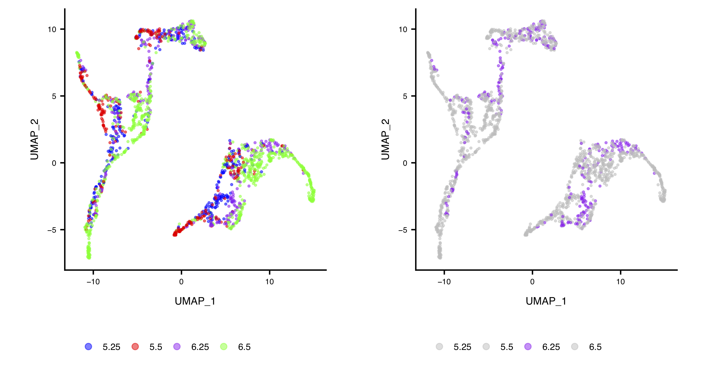 |
| ------------ | ----- |
| __Legend__ | UMAP showing distribution of cells by age |
| __Download__ |  [[PDF](scRNA/CTR_mz205_0007_scUMAPs.Ages.pdf)] |

#### Plot gene specific UMAPs

For all ages (5.25, 5.5, 6.25 and 6.5) unless stated otherwise.

| Figure Number | Genes | UMAP    | PDF | Legend |
| ----------- | ----- | ------- | --- | ------ |
| __Fig E4C__    | All Mmp genes | 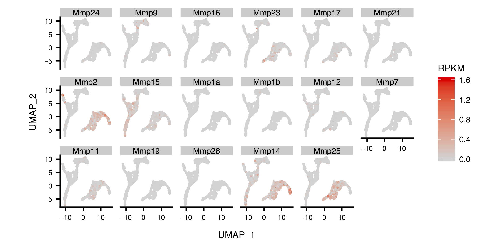 | [[PDF](scRNA/CTR_mz205_0007_scUMAPs.All.Mmp.pdf)]     | Expression levels for all available Mmp genes are plotted on the UMAP for all cell types. All expression values are log(counts). |
| -    | Mmp2, Mmp14, Mmp25 | 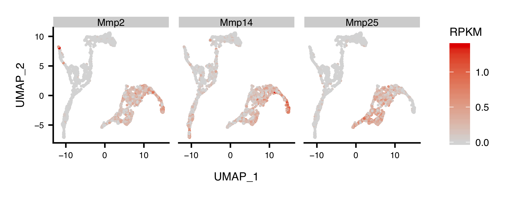 | [[PDF](scRNA/CTR_mz205_0007_scUMAPs.Main.Mmp.pdf)]  | As above but just for Mmp2, Mmp14 and Mmp25 |
| -    | At 6.25 Only: Mmp2, Mmp14, Mmp25 | 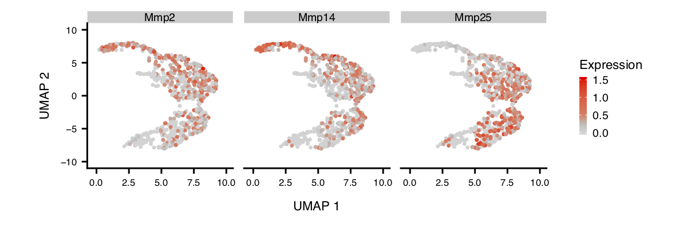 | [[PDF](scRNA/CTR_mz205_0007_scUMAPs.Main.Mmp.EPI.6.plus.pdf)]  | As above but the UMAP has been zoomed in to only show the Epiblase cluster. |
| -    | Marker Genes | 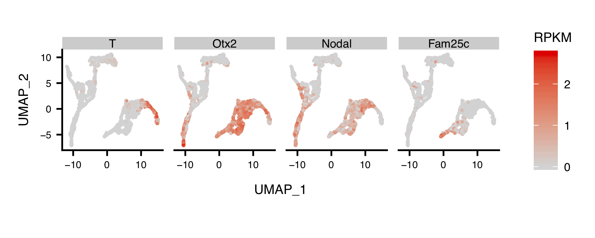 | [[PDF](scRNA/CTR_mz205_0007_scUMAPs.Markers.pdf)]     | As above but for known marker genes T, Otx2, Nodal and Fam25c. |
| __Fig E5A (top)__ | Laminins | 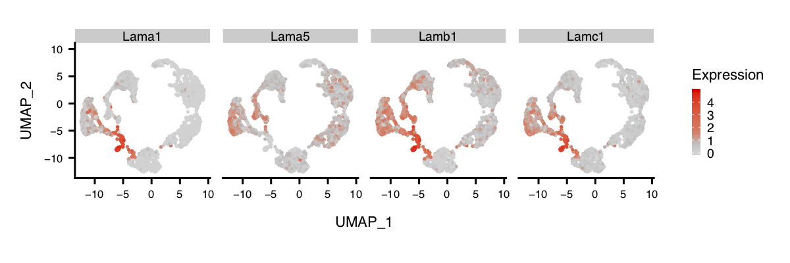 | [[PDF](scRNA/CTR_mz205_0007_scUMAPs.Laminins.pdf)]   | As above but for the Laminin genes (Lama1, Lama5, Lamb1, Lamc1)
| __Fig E5A (bottom)__ | Collagens | 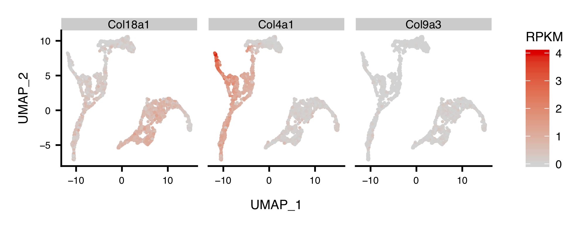 | [[PDF](scRNA/CTR_mz205_0007_scUMAPs.Collagens.pdf)] | As above but for the Collagen genes (Col18a1, Col4a1, Col9a3) |


#### Summarise Gene Level UMAPs

| Figure 3C | 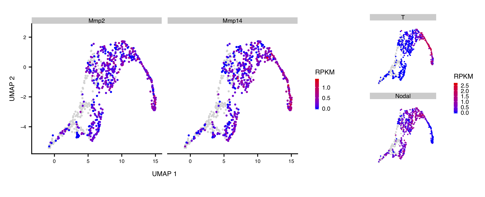 |
| --------- | --------------------------------------------------------------- |
| __Legend__ | Expression levels for Mmp genes (Mmp2, Mmp14 & Mmp25) and known marker genes (T, Nodal, Tdgf1) are plotted on the UMAP for just the Epiblast cell types identified in Figure __3C__. All expression values are log(counts). |
| __Download__ | [[PDF](scRNA/CTR_mz205_0007_scUMAPs.Figure.pdf)] |


### Step 2: Analyse expression for Mmp genes in published scRNA-seq data

#### Expression Vs Age

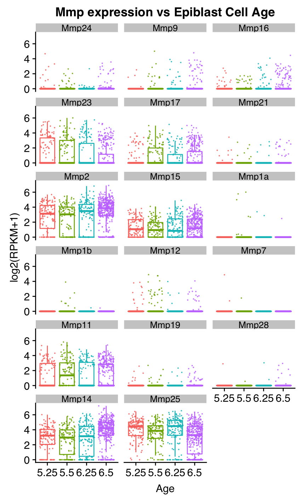

__Download Figure__: [[CTR_mz205_0007_mmp.age.pdf](scRNA/CTR_mz205_0007_mmp.age.pdf)] [[CTR_mz205_0007_mmp.age.png](scRNA/CTR_mz205_0007_mmp.age.png)]

> Table: Mean Expression of Mmp genes (Epiblast)
> The expression values are a mean of each Mmp RNA across all epiblast cells (at individual time points), this will include cells where no expression is detected.

| Mmp   |  5.25 |  5.5  |  6.25 |   6.5 |
| ----- | ----: | ----: | ----: | ----: |
| Mmp24 |  0.41 | 0.18  |  0.05 |  0.21 |
| Mmp9  |  0.07 | 0.53  |  0.40 |  0.52 |
| Mmp16 |  0.19 | 0.19  |  0.57 |  0.52 |
| Mmp23 |  5.39 | 5.35  |  4.61 |  2.50 |
| Mmp17 |  1.20 | 2.51  |  1.86 |  1.95 |
| Mmp21 |  0.15 | 0.14  |  0.12 |  0.16 |
| Mmp2  | 11.16 | 9.52  | 13.64 | 16.01 |
| Mmp15 |  2.50 | 2.00  |  2.93 |  2.65 |
| Mmp1a |  0.00 | 1.33  |  0.11 |  0.01 |
| Mmp1b |  0.00 | 0.21  |  0.00 |  0.00 |
| Mmp12 |  0.51 | 1.60  |  0.20 |  0.16 |
| Mmp7  |  0.23 | 0.02  |  0.00 |  0.00 |
| Mmp11 |  3.83 | 5.79  |  3.83 |  3.48 |
| Mmp19 |  0.11 | 0.13  |  0.08 |  0.08 |
| Mmp28 |  0.05 | 0.00  |  0.06 |  0.06 |
| Mmp14 | 11.32 | 9.99  | 13.70 | 21.59 |
| Mmp25 | 22.69 | 17.15 | 23.91 | 13.35 |

> Mean Expression of Mmp genes (Epiblast)
> For cells with expression > 0 for each Mmp RNA

| Mmp   |  5.25 |  5.5  |  6.25 |   6.5 |
| ----- | ----: | ----: | ----: | ----: |
| Mmp24 |  4.36 |  1.37 |  0.74 |  2.42 |
| Mmp9  |  2.32 |  4.55 |  3.60 |  5.55 |
| Mmp16 |  1.45 |  1.22 |  3.52 |  3.17 |
| Mmp23 | 12.10 | 11.46 | 15.34 |  9.07 |
| Mmp17 |  4.78 |  6.15 |  6.20 |  6.18 |
| Mmp21 |  2.40 |  2.39 |  3.41 |  3.49 |
| Mmp2  | 14.28 | 13.60 | 18.58 | 18.63 |
| Mmp15 |  3.41 |  3.20 |  4.66 |  4.17 |
| Mmp1a |   NaN | 19.99 |  7.89 |  4.59 |
| Mmp1b |   NaN |  3.21 |  0.38 |  0.36 |
| Mmp12 |  4.67 |  7.13 |  4.72 |  3.46 |
| Mmp7  | 15.03 |  2.42 |   NaN |   NaN |
| Mmp11 |  9.25 | 10.37 |  9.60 |  8.41 |
| Mmp19 |  1.68 |  1.58 |  1.84 |  1.45 |
| Mmp28 |  6.47 |  0.47 |  3.97 |  2.72 |
| Mmp14 | 13.54 | 12.89 | 17.04 | 24.24 |
| Mmp25 | 23.05 | 18.38 | 27.13 | 17.27 |


### Step 3: Analyse correlation of expression of Mmp genes with marker genes

#### Correlations to marker genes
After extraction of the Epiblast cells from the scRNA-seq the next step is to plot the Mmp expression values against a selection of markers: T, Otx2 and Nodal. r values are Pearson's correlations with p.value.

<table>
  <tr>
    <td><i>Gene</i></td><td><b>Mmp25</b></td><td><b>Mmp14</b></td><td><b>Mmp2</b></td>
  </tr>
  <tr>
    <td><i>Figure Number</i></td><td><b>Fig E4F (left)</b></td><td><b>Fig E4F (center)</b></td><td><b>Fig E4F (right)</b></td>
  </tr>
  <tr>
    <td></td><td>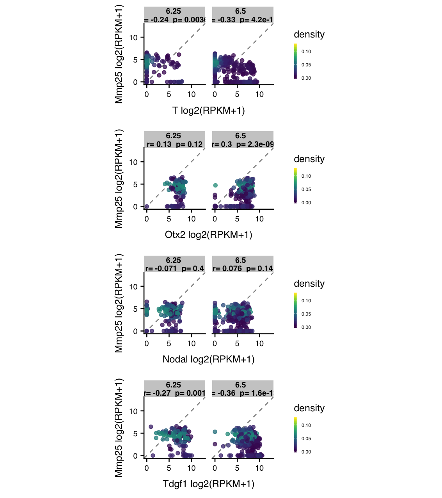 </td><td> 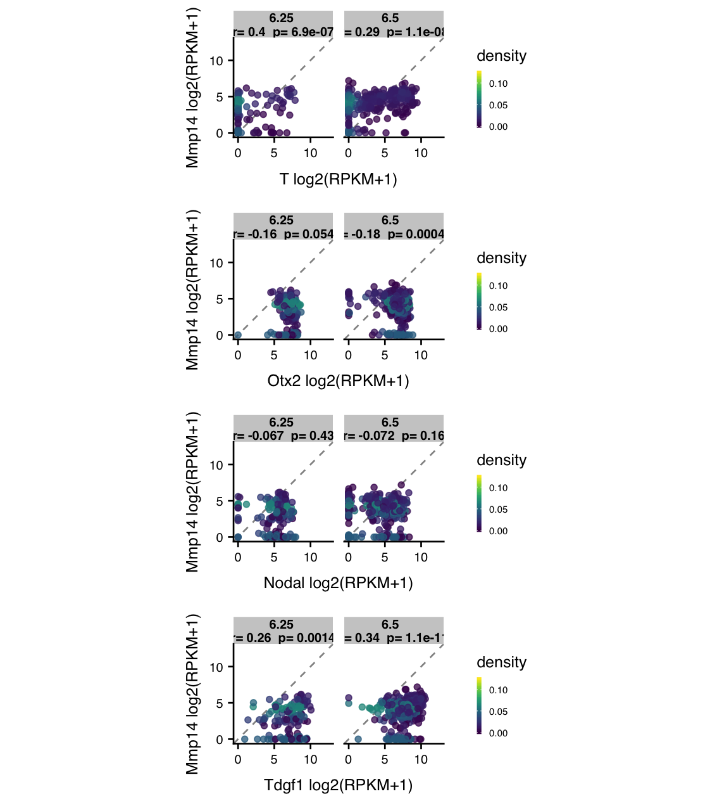 </td><td> 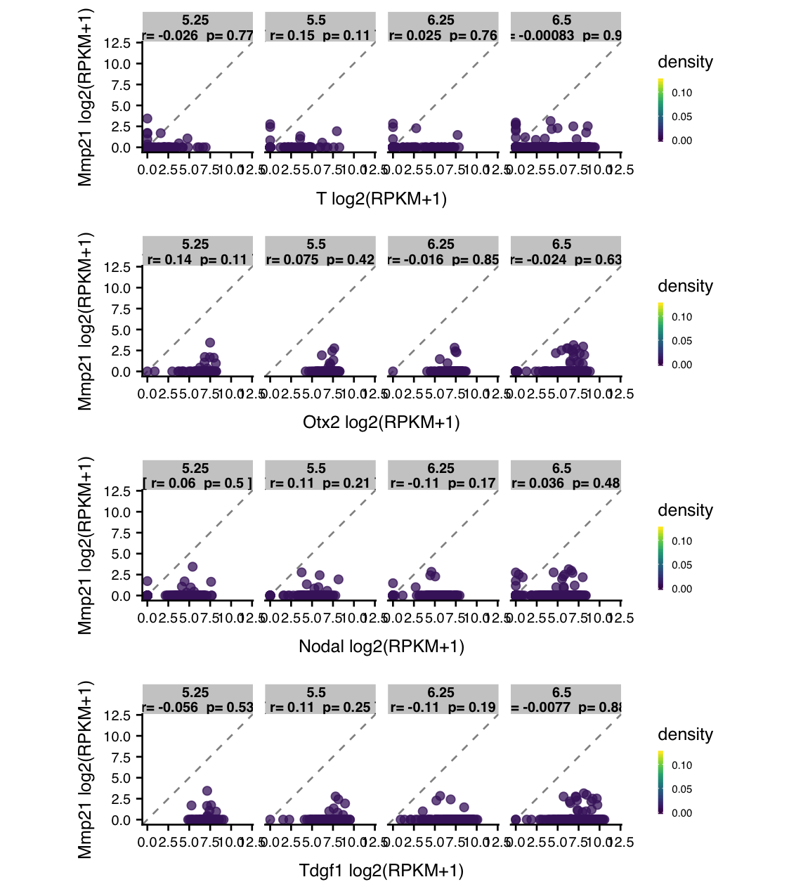 </td>
  </tr>
  <tr align=center>
    <td><i>Download</i></td><td > <A HREF=scRNA/CTR_mz205_0007_Mmp25.pdf>[PDF]</A> </td><td> <A HREF=scRNA/CTR_mz205_0007_Mmp14.pdf>[PDF]</A> </td><td> <A HREF=scRNA/CTR_mz205_0007_Mmp2.pdf>[PDF]</A> </td>
  </tr>  
  <tr>  
    <td><i>Legend</i></td><td colspan=3>The matrix of RPKM values from [GSE109071](https://www.ncbi.nlm.nih.gov/geo/query/acc.cgi?acc=GSE109071) was used to calculate gene expression correlation between pairs of genes. Epiblast cells at ages 6.25 and 6.5 were extracted from the matrix and  Pearson's correlation coefficient (R) with p-value are given for each comparison. The points are coloured by density (kde2d)</td>
  </tr>
</table>


> For all available Mmp Genes

| Mmp   | PNG | PDF  |
| ----- | --- | ---- |
| Mmp1a | [CTR_mz205_0007_Mmp1a.png](scRNA/CTR_mz205_0007_Mmp1a.png) | [CTR_mz205_0007_Mmp1a.pdf](scRNA/CTR_mz205_0007_Mmp1a.pdf) |
| Mmp1b | [CTR_mz205_0007_Mmp1b.png](scRNA/CTR_mz205_0007_Mmp1b.png) | [CTR_mz205_0007_Mmp1b.pdf](scRNA/CTR_mz205_0007_Mmp1b.pdf) |
| __Mmp2__  | [CTR_mz205_0007_Mmp2.png](scRNA/CTR_mz205_0007_Mmp2.png)   | [CTR_mz205_0007_Mmp2.pdf](scRNA/CTR_mz205_0007_Mmp2.pdf) |
| Mmp3 | _missing_ | _missing_ |
| Mmp7  | [CTR_mz205_0007_Mmp7.png](scRNA/CTR_mz205_0007_Mmp7.png)   | [CTR_mz205_0007_Mmp7.pdf](scRNA/CTR_mz205_0007_Mmp7.pdf) |
| Mmp8 | _missing_ | _missing_ |
| Mmp9  | [CTR_mz205_0007_Mmp9.png](scRNA/CTR_mz205_0007_Mmp9.png)   | [CTR_mz205_0007_Mmp9.pdf](scRNA/CTR_mz205_0007_Mmp9.pdf) |
| Mmp10 | _missing_ | _missing_ |
| Mmp11 | [CTR_mz205_0007_Mmp11.png](scRNA/CTR_mz205_0007_Mmp11.png) | [CTR_mz205_0007_Mmp11.pdf](scRNA/CTR_mz205_0007_Mmp11.pdf) |
| Mmp12 | [CTR_mz205_0007_Mmp12.png](scRNA/CTR_mz205_0007_Mmp12.png) | [CTR_mz205_0007_Mmp12.pdf](scRNA/CTR_mz205_0007_Mmp12.pdf) |
| Mmp13 | _missing_ | _missing_ |
| __Mmp14__ | [CTR_mz205_0007_Mmp14.png](scRNA/CTR_mz205_0007_Mmp14.png) | [CTR_mz205_0007_Mmp14.pdf](scRNA/CTR_mz205_0007_Mmp14.pdf) |
| Mmp15 | [CTR_mz205_0007_Mmp15.png](scRNA/CTR_mz205_0007_Mmp15.png) | [CTR_mz205_0007_Mmp15.pdf](scRNA/CTR_mz205_0007_Mmp15.pdf) |
| Mmp16 | [CTR_mz205_0007_Mmp16.png](scRNA/CTR_mz205_0007_Mmp16.png) | [CTR_mz205_0007_Mmp16.pdf](scRNA/CTR_mz205_0007_Mmp16.pdf) |
| Mmp17 | [CTR_mz205_0007_Mmp17.png](scRNA/CTR_mz205_0007_Mmp17.png) | [CTR_mz205_0007_Mmp17.pdf](scRNA/CTR_mz205_0007_Mmp17.pdf) |
| Mmp19 | [CTR_mz205_0007_Mmp19.png](scRNA/CTR_mz205_0007_Mmp19.png) | [CTR_mz205_0007_Mmp19.pdf](scRNA/CTR_mz205_0007_Mmp19.pdf) |
| Mmp21 | [CTR_mz205_0007_Mmp21.png](scRNA/CTR_mz205_0007_Mmp21.png) | [CTR_mz205_0007_Mmp21.pdf](scRNA/CTR_mz205_0007_Mmp21.pdf) |
| Mmp23 | [CTR_mz205_0007_Mmp23.png](scRNA/CTR_mz205_0007_Mmp23.png) | [CTR_mz205_0007_Mmp23.pdf](scRNA/CTR_mz205_0007_Mmp23.pdf) |
| Mmp24 | [CTR_mz205_0007_Mmp24.png](scRNA/CTR_mz205_0007_Mmp24.png) | [CTR_mz205_0007_Mmp24.pdf](scRNA/CTR_mz205_0007_Mmp24.pdf) |
| __Mmp25__ | [CTR_mz205_0007_Mmp25.png](scRNA/CTR_mz205_0007_Mmp25.png) | [CTR_mz205_0007_Mmp25.pdf](scRNA/CTR_mz205_0007_Mmp25.pdf) |
| Mmp26 | _missing_ | _missing_ |
| Mmp27 | _missing_ | _missing_ |
| Mmp28 | [CTR_mz205_0007_Mmp28.png](CTR_mz205_0007_Mmp28.png) | [CTR_mz205_0007_Mmp28.png](CTR_mz205_0007_Mmp28.png) |

Missing Mmps, not present in the scRNA RPKM matrix.

| Mmp   | Reason missing |
| ----- | -------------- |
| Mmp3  | ? |
| Mmp8  | ? |
| Mmp10 | ? |
| Mmp13 | ? |
| Mmp26 | not found in mouse |
| Mmp27 | ? |

> Table of Pearson's Correlations of Mmp genes to T, Nodal, Tdgf1 and Otx2 marker genes.

| Mmp | Marker | 5.25 (R) | 5.25 (p.val) | 5.5 (R) | 5.5 (p.val) | 6.25 (R) | 6.25 (p.val) | 6.5 (R) | 6.5 (p.val) |
| --- | ------ | -------- | ------------ | ------- | ----------- | -------- | ------------ | ------- | ----------- |
  | Mmp24 | T | -0.02 | 0.82 | -0.027 | 0.77 | -0.025 | 0.77 | -0.038 | 0.46 |
  |       | Otx2 | -0.2 | 0.022 | 0.032 | 0.73 | 0.053 | 0.53 | 0.015 | 0.77 |
  |       | Nodal | -0.077 | 0.38 | -0.065 | 0.48 | -0.069 | 0.41 | 0.019 | 0.7 |
  |       | Tdgf1 | -0.015 | 0.87 | 0.0059 | 0.95 | -0.056 | 0.5 | -0.037 | 0.47 |
  | Mmp9  | T | 0.034 | 0.7 | -0.047 | 0.61 | 0.22 | 0.0085 | 0.09 | 0.077 |
  |       | Otx2 | -0.11 | 0.22 | -0.04 | 0.66 | -0.13 | 0.11 | -0.11 | 0.03 |
  |       | Nodal | 0.015 | 0.87 | 0.027 | 0.77 | 0.039 | 0.64 | -0.0087 | 0.86 |
  |       | Tdgf1 | -0.029 | 0.75 | 0.15 | 0.11 | 0.13 | 0.11 | 0.087 | 0.089 |
  | Mmp16 | T | -0.037 | 0.67 | 0.077 | 0.4 | -0.063 | 0.46 | -0.043 | 0.4 |
  |       | Otx2 | 0.02 | 0.83 | 0.14 | 0.14 | -0.036 | 0.67 | 0.022 | 0.67 |
  |       | Nodal | 0.17 | 0.059 | 0.15 | 0.1 | 0.022 | 0.79 | 0.12 | 0.021 |
  |       | Tdgf1 | 0.099 | 0.27 | 0.0076 | 0.93 | 0.024 | 0.78 | 0.0025 | 0.96 |
  | Mmp23 | T | -0.1 | 0.26 | -0.097 | 0.29 | -0.14 | 0.092 | -0.095 | 0.064 |
  |       | Otx2 | -0.072 | 0.42 | -0.068 | 0.46 | 0.16 | 0.053 | 0.033 | 0.51 |
  |       | Nodal | -0.18 | 0.043 | -0.17 | 0.063 | 0.017 | 0.84 | 0.077 | 0.13 |
  |       | Tdgf1 | -0.049 | 0.58 | -0.16 | 0.084 | -0.23 | 0.0068 | -0.063 | 0.22 |
  | Mmp17 | T | 0.084 | 0.35 | -0.12 | 0.18 | -0.13 | 0.12 | -0.099 | 0.053 |
  |       | Otx2 | 0.02 | 0.82 | -0.11 | 0.24 | 0.0024 | 0.98 | 0.083 | 0.11 |
  |       | Nodal | 0.057 | 0.53 | -0.045 | 0.63 | -0.13 | 0.12 | 0.059 | 0.25 |
  |       | Tdgf1 | -0.12 | 0.19 | -0.12 | 0.19 | -0.098 | 0.25 | -0.14 | 0.006 |
  | Mmp21 | T | -0.026 | 0.77 | 0.15 | 0.11 | 0.025 | 0.76 | -0.00083 | 0.99 |
  |       | Otx2 | 0.14 | 0.11 | 0.075 | 0.42 | -0.016 | 0.85 | -0.024 | 0.63 |
  |       | Nodal | 0.06 | 0.5 | 0.11 | 0.21 | -0.11 | 0.17 | 0.036 | 0.48 |
  |       | Tdgf1 | -0.056 | 0.53 | 0.11 | 0.25 | -0.11 | 0.19 | -0.0077 | 0.88 |
  | Mmp2  | T | 0.017 | 0.85 | 0.059 | 0.52 | 0.26 | 0.002 | 0.05 | 0.32 |
  |       | Otx2 | 0.12 | 0.19 | 0.084 | 0.36 | -0.11 | 0.18 | -0.17 | 0.00074 |
  |       | Nodal | 0.033 | 0.71 | 0.32 | 0.00042 | -0.093 | 0.27 | 0.0084 | 0.87 |
  |       | Tdgf1 | 0.0049 | 0.96 | 0.2 | 0.03 | 0.2 | 0.017 | 0.15 | 0.0034 |
  | Mmp15 | T | -0.052 | 0.56 | -0.02 | 0.83 | -0.059 | 0.48 | -0.21 | 2.6e-05 |
  |       | Otx2 | -0.039 | 0.66 | -0.062 | 0.5 | -0.0014 | 0.99 | 0.17 | 0.00062 |
  |       | Nodal | -0.025 | 0.78 | -0.039 | 0.67 | -0.063 | 0.45 | 0.028 | 0.58 |
  |       | Tdgf1 | 0.005 | 0.96 | -0.09 | 0.33 | -0.008 | 0.92 | -0.15 | 0.0034 |
  | Mmp1a | T | NA | NA | -0.05 | 0.58 | -0.024 | 0.78 | 0.014 | 0.79 |
  |       | Otx2 | NA | NA | -0.079 | 0.39 | 0.0038 | 0.96 | 0.11 | 0.029 |
  |       | Nodal | NA | NA | 0.013 | 0.89 | -0.041 | 0.63 | -0.00038 | 0.99 |
  |       | Tdgf1 | NA | NA | 0.16 | 0.08 | 0.082 | 0.33 | 0.1 | 0.045 |
  | Mmp1b | T | NA | NA | -0.048 | 0.6 | -0.0058 | 0.94 | 0.051 | 0.32 |
  |       | Otx2 | NA | NA | -0.074 | 0.42 | -0.075 | 0.37 | 0.049 | 0.34 |
  |       | Nodal | NA | NA | 0.023 | 0.8 | 0.012 | 0.89 | -0.038 | 0.46 |
  |       | Tdgf1 | NA | NA | 0.12 | 0.18 | 0.034 | 0.68 | 0.054 | 0.29 |
  | Mmp12 | T | -0.068 | 0.45 | -0.093 | 0.31 | -0.057 | 0.5 | -0.066 | 0.2 |
  |       | Otx2 | -0.19 | 0.036 | 0.15 | 0.11 | -0.14 | 0.097 | -0.12 | 0.023 |
  |       | Nodal | -0.079 | 0.37 | 0.007 | 0.94 | -0.0023 | 0.98 | -0.026 | 0.61 |
  |       | Tdgf1 | -0.08 | 0.37 | 0.29 | 0.0011 | -0.11 | 0.19 | -0.035 | 0.5 |
  | Mmp7  | T | -0.025 | 0.78 | -0.028 | 0.76 | NA | NA | NA | NA |
  |       | Otx2 | 0.052 | 0.56 | 0.023 | 0.8 | NA | NA | NA | NA |
  |       | Nodal | -0.042 | 0.64 | -0.095 | 0.3 | NA | NA | NA | NA |
  |       | Tdgf1 | 0.061 | 0.49 | -0.0022 | 0.98 | NA | NA | NA | NA |
  | Mmp11 | T | -0.052 | 0.56 | -0.13 | 0.16 | -0.11 | 0.2 | -0.09 | 0.079 |
  |       | Otx2 | 0.12 | 0.19 | 0.13 | 0.16 | 0.19 | 0.023 | 0.044 | 0.39 |
  |       | Nodal | 0.15 | 0.095 | 0.044 | 0.63 | -0.011 | 0.89 | 0.052 | 0.31 |
  |       | Tdgf1 | 0.17 | 0.052 | 0.03 | 0.74 | -0.15 | 0.066 | -0.1 | 0.045 |
  | Mmp19 | T | -0.034 | 0.7 | -0.032 | 0.73 | 0.14 | 0.1 | 0.012 | 0.81 |
  |       | Otx2 | -0.1 | 0.25 | -0.062 | 0.5 | -0.0018 | 0.98 | -0.095 | 0.064 |
  |       | Nodal | 0.074 | 0.4 | -0.085 | 0.35 | -0.066 | 0.44 | -0.017 | 0.74 |
  |       | Tdgf1 | 0.058 | 0.52 | -0.056 | 0.54 | -0.065 | 0.44 | 0.019 | 0.71 |
  | Mmp28 | T | -0.025 | 0.78 | -0.021 | 0.82 | -0.037 | 0.66 | -0.0059 | 0.91 |
  |       | Otx2 | -0.1 | 0.26 | 0.096 | 0.3 | 0.048 | 0.57 | -0.088 | 0.085 |
  |       | Nodal | -0.02 | 0.82 | -0.034 | 0.72 | 0.18 | 0.033 | 0.017 | 0.74 |
  |       | Tdgf1 | -0.1 | 0.24 | -0.064 | 0.49 | 0.0088 | 0.92 | 0.038 | 0.45 |
  | Mmp14 | T | 0.072 | 0.42 | 0.092 | 0.32 | 0.4 | 6.9e-07 | 0.29 | 1.1e-08 |
  |       | Otx2 | -0.033 | 0.71 | -0.039 | 0.67 | -0.16 | 0.054 | -0.18 | 0.00044 |
  |       | Nodal | -0.008 | 0.93 | -0.087 | 0.34 | -0.067 | 0.43 | -0.072 | 0.16 |
  |       | Tdgf1 | -0.026 | 0.77 | 0.088 | 0.34 | 0.26 | 0.0014 | 0.34 | 1.1e-11 |
  | Mmp25 | T | -0.26 | 0.0029 | -0.16 | 0.074 | -0.24 | 0.0036 | -0.33 | 4.2e-11 |
  |       | Otx2 | 0.072 | 0.42 | 0.15 | 0.099 | 0.13 | 0.12 | 0.3 | 2.3e-09 |
  |       | Nodal | -9e-04 | 0.99 | -0.014 | 0.88 | -0.071 | 0.4 | 0.076 | 0.14 |
  |       | Tdgf1 | 0.18 | 0.043 | 0.0023 | 0.98 | -0.27 | 0.001 | -0.36 | 1.6e-13 |


## Investigating Mmp ChIP-Seq associations

ChIP Data generated in this paper:

* Wang, Q., Zou, Y., Nowotschin, S., Kim, S.Y., Li, Q.V. Soh, C., Su, J. Zhang, C., Shu, W. Xi, Q., Huangfu, D., Hadjantonakis, A. and Massague, J. (2017) The p53 Family Coordinates Wnt and Nodal Inputs in Mesendodermal Differentiation of Embryonic Stem Cells. Cell Stem Cell, 20(11), 70-86. [[DOI](https://doi.org/10.1016/j.stem.2016.10.002)]

And used in:

* Senft, A.D., Costello, I., King, H.W., Mould, A.W., Bikoff, E.K. and Robertson, E.J. (2018) Combinatorial Smad2/3 Activities Downstream of Nodal Signaling Maintain Embryonic/Extra-Embryonic Cell Identities during Lineage Priming. Cell Reports, 24(8), 1977--1985.e7. [[DOI](https://doi.org/10.1016/j.celrep.2018.07.077)]

Accession for data:
* [GSE70486 TDF files](https://www.ncbi.nlm.nih.gov/geo/query/acc.cgi?acc=GSE70486)

Four tracks were chosen
* GSM1782914_Smad2_3_D3EB_AC_E14
* GSM1782915_Smad2_3_D3EB_SB_E14                      
* GSM1782928_Smad2_3_D3EB_AC_p53WT
* GSM1782929_Smad2_3_D3EB_SB_p53WT

The tracks are in IGVs __tdf__ format, but to be compatible with `karyoploteR` they must first be converted to __bedgraph__, and then finally to __bigwig__ using [convert_tdf2bedgraph2bigwig.sh](ChIP/convert_tdf2bedgraph2bigwig.sh) (which itself calls [bdg2bw.sh](ChIP/bdg2bw.sh) taken from this [Gist](https://gist.github.com/taoliu/2469050))

For the paper ChIP figure Mmp2 and Mmp14, IGV was used so the TDF format tracks could be normalised to give RPM (reads per million) i.e. signal intensities were normalised by 1x10^6/total reads.

__Methods: ChIP-Seq__

ChIP tracks for Smad2_3 from [GSE70486](https://www.ncbi.nlm.nih.gov/geo/query/acc.cgi?acc=GSE70486)(from 10.1016/j.stem.2016.10.002) in TDF (tiled data file) format were visualised in IGV (Integrative Genomics Viewer, 10.1038/nbt.1754) and signal intensities were normalised by 1x10^6/total reads to give RPM (Reads per million). Scripts to recreate ChIP-Seq analysis and figures can be found at [github.com/darogan/CTR_mz205_0007](http://github.com/darogan/CTR_mz205_0007). Analysis was performed using R (v3.4.4).

<BR>

| Mmp   | ChIP Track Figure                          | Paper Figure    | PDF/SVG |
| ----- | ------------------------------------------ | --- | --- |
| Mmp2 | 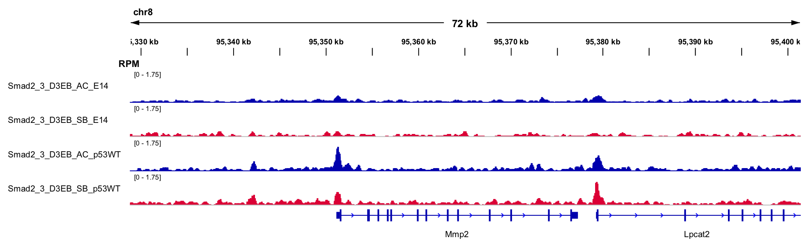   | Fig E5F (top)    | [[PDF](ChIP/Mmp2_igv.pdf)] [[SVG](ChIP/Mmp2_igv.svg)]|
| Mmp14 | 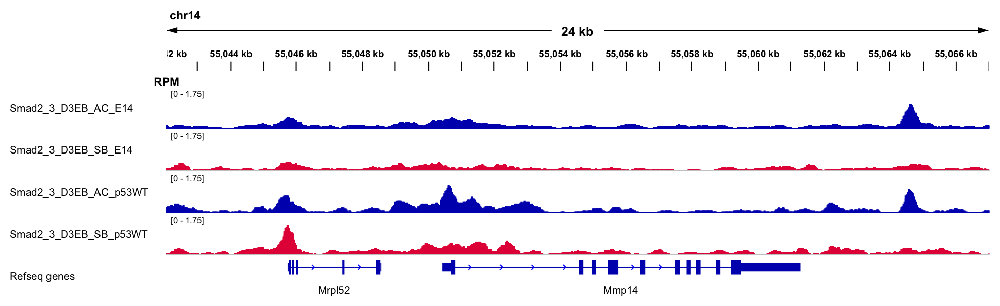 | Fig E5F (bottom) | [[PDF](ChIP/Mmp14_igv.pdf)] [[SVG](ChIP/Mmp14_igv.svg)] |

__Figure E5, Legend__: ChIP tracks for Smad2_3 from [GSE70486](https://www.ncbi.nlm.nih.gov/geo/query/acc.cgi?acc=GSE70486) in TDF format were visualied in IGV (Integrative Genomics Viewer, 10.1038/nbt.1754) and signal intensities were normalised by 1x10^6/total reads to give RPM (Reads per million).

<P><BR>

KaryoploteR versions of the ChIP plots. Note these have not been normalised to RPM values.

| Mmp   | ChIP Track Figure             |
| ----- | ----------------------------- |
| Mmp11 | [CTR_mz205_0007.ChIP.Mmp11.pdf](ChIP/CTR_mz205_0007.ChIP.Mmp11.pdf) |
| Mmp12 | [CTR_mz205_0007.ChIP.Mmp12.pdf](ChIP/CTR_mz205_0007.ChIP.Mmp12.pdf) |
| Mmp14 | [CTR_mz205_0007.ChIP.Mmp14.pdf](ChIP/CTR_mz205_0007.ChIP.Mmp14.pdf) |
| Mmp15 | [CTR_mz205_0007.ChIP.Mmp15.pdf](ChIP/CTR_mz205_0007.ChIP.Mmp15.pdf) |
| Mmp16 | [CTR_mz205_0007.ChIP.Mmp16.pdf](ChIP/CTR_mz205_0007.ChIP.Mmp16.pdf) |
| Mmp17 | [CTR_mz205_0007.ChIP.Mmp17.pdf](ChIP/CTR_mz205_0007.ChIP.Mmp17.pdf) |
| Mmp19 | [CTR_mz205_0007.ChIP.Mmp19.pdf](ChIP/CTR_mz205_0007.ChIP.Mmp19.pdf) |
| Mmp1a | [CTR_mz205_0007.ChIP.Mmp1a.pdf](ChIP/CTR_mz205_0007.ChIP.Mmp1a.pdf) |
| Mmp1b | [CTR_mz205_0007.ChIP.Mmp1b.pdf](ChIP/CTR_mz205_0007.ChIP.Mmp1b.pdf) |
| Mmp2  | [CTR_mz205_0007.ChIP.Mmp2.pdf](ChIP/CTR_mz205_0007.ChIP.Mmp2.pdf)  |
| Mmp21 | [CTR_mz205_0007.ChIP.Mmp21.pdf](ChIP/CTR_mz205_0007.ChIP.Mmp21.pdf) |
| Mmp23 | [CTR_mz205_0007.ChIP.Mmp23.pdf](ChIP/CTR_mz205_0007.ChIP.Mmp23.pdf) |
| Mmp24 | [CTR_mz205_0007.ChIP.Mmp24.pdf](ChIP/CTR_mz205_0007.ChIP.Mmp24.pdf) |
| Mmp25 | [CTR_mz205_0007.ChIP.Mmp25.pdf](ChIP/CTR_mz205_0007.ChIP.Mmp25.pdf) |
| Mmp28 | [CTR_mz205_0007.ChIP.Mmp28.pdf](ChIP/CTR_mz205_0007.ChIP.Mmp28.pdf) |
| Mmp7  | [CTR_mz205_0007.ChIP.Mmp7.pdf](ChIP/CTR_mz205_0007.ChIP.Mmp7.pdf)  |
| Mmp9  | [CTR_mz205_0007.ChIP.Mmp9.pdf](ChIP/CTR_mz205_0007.ChIP.Mmp9.pdf)  |


## Software Versions & Methods

````
R version 3.4.4 (2018-03-15)
Platform: x86_64-apple-darwin15.6.0 (64-bit)
Running under: macOS  10.14.4

Matrix products: default
BLAS: /System/Library/Frameworks/Accelerate.framework/Versions/A/Frameworks/vecLib.framework/Versions/A/libBLAS.dylib
LAPACK: /Library/Frameworks/R.framework/Versions/3.4/Resources/lib/libRlapack.dylib

locale:
[1] en_GB.UTF-8/en_GB.UTF-8/en_GB.UTF-8/C/en_GB.UTF-8/en_GB.UTF-8

attached base packages:
[1] stats     graphics  grDevices utils     datasets  methods   base     

other attached packages:
 [1] matrixStats_0.54.0 umap_0.2.2.0       viridis_0.5.1      viridisLite_0.3.0  cowplot_0.9.4      reshape2_1.4.3     dplyr_0.8.1       
 [8] Seurat_3.0.1       useful_1.2.6       ggplot2_3.1.1      Rtsne_0.15        
````

## Contact

Contact Russell S. Hamilton (rsh46 -at- cam.ac.uk)
